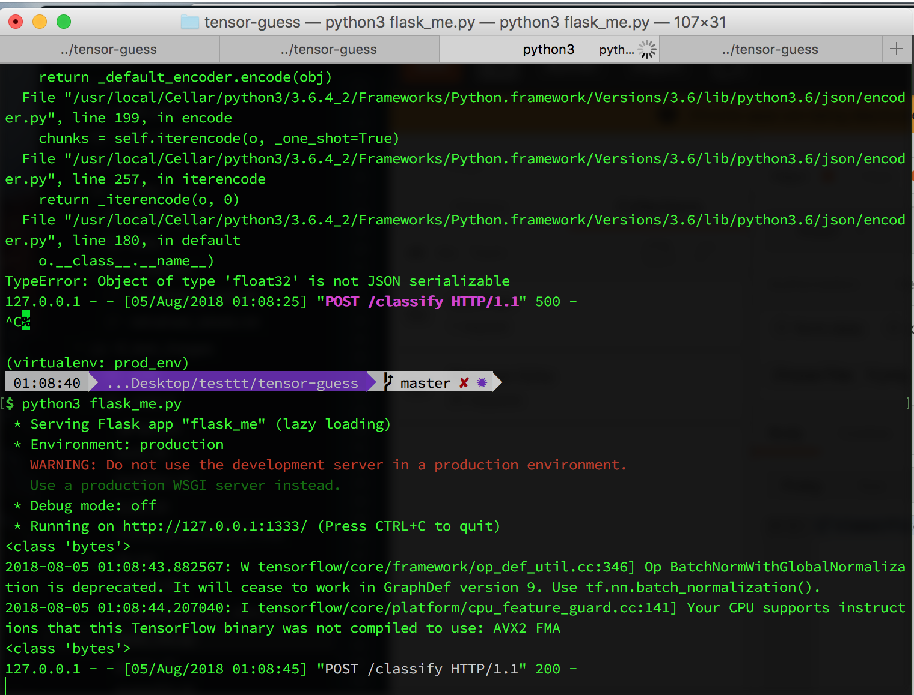

# README

# What this is
- Google's [Inception CNN](https://ai.googleblog.com/2016/03/train-your-own-image-classifier-with.html) (trained on 100k images for 1 week) 
- Inception is a an image classification deep learning model with 1000 categories 
- adapted to our use case using [Transfer Learning](https://www.tensorflow.org/hub/tutorials/image_retraining)
- trained using a [docker container thanks to @xblaster](https://github.com/xblaster/tensor-guess) for 4000 epochs ~ 1 hour
- has a flask REST API

## Inception Architecture

# How to use

Precondition: install stuff in `requirements.txt`, virtual environments are a good idea.

## API
1. Spin up Flask API

2. Attach a photo as binary and post it to /classify

Eminem is in `rand_tests/8.jpeg`
 

Idk what is happening in `rand_tests/3.jpg` but it doesn't look great.

3. It got classified!

**Eminem (8.jpeg)  is chill!**

**This (3.jpg) is not chill (is violent)**

## Training
use case: predict if the images are chill or violent

1. downloaded a bunch of Google image search results using a [chrome ext](https://chrome.google.com/webstore/detail/fatkun-batch-download-ima/nnjjahlikiabnchcpehcpkdeckfgnohf)

2. downloaded a bunch of youtube videos and turned them into frames using [this](https://github.com/Hvass-Labs/TensorFlow-Tutorials/blob/master/convert.py)

3. trained on the data set using [this](https://github.com/xblaster/tensor-guess) splitting the data set 80:20 for train test randomly sampling from the images

4. during training checkpoints saved in `tf_files/bottlenecks`, after training the tensorflow computation graph & weights are saved in `tf_files/retrained_graph.pb` as a protobuffer and class labels in `tf_files/retrained_labels.txt`

5. evaluated achieving 99% accuracy using `evaluate_vs_test_data.py`and works with the random photos in `rand_tests`, can run with `query_model.py` and point at the right image.